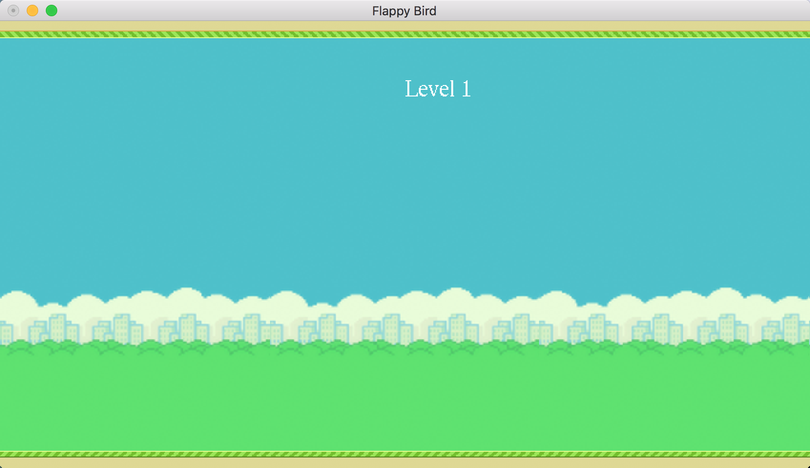
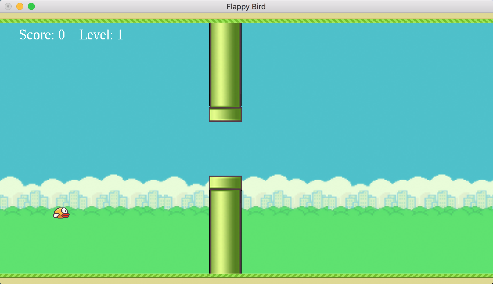
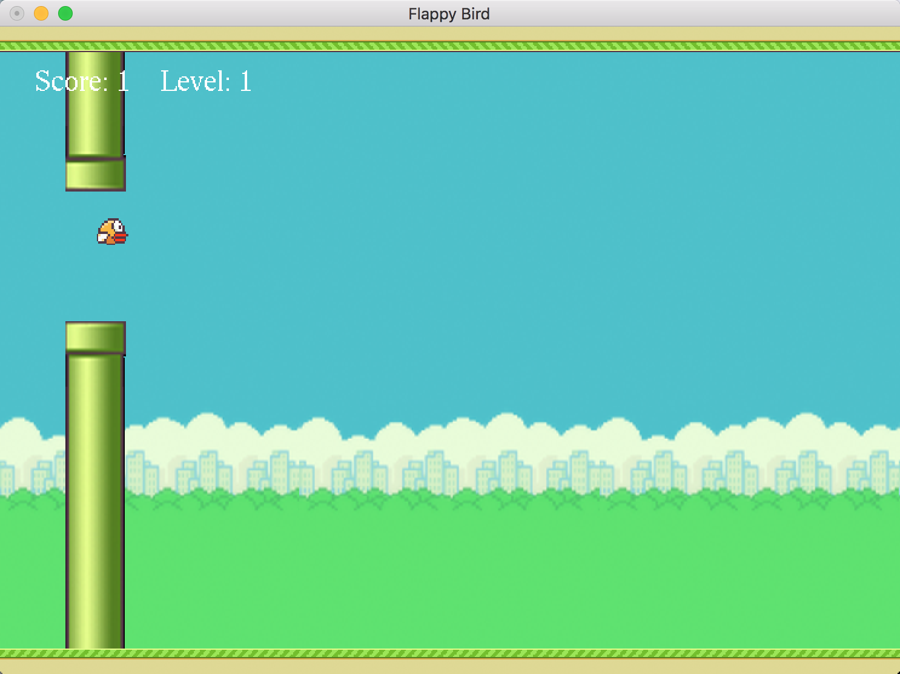
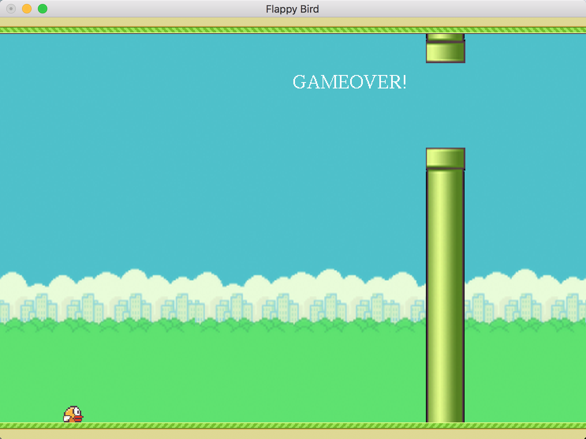
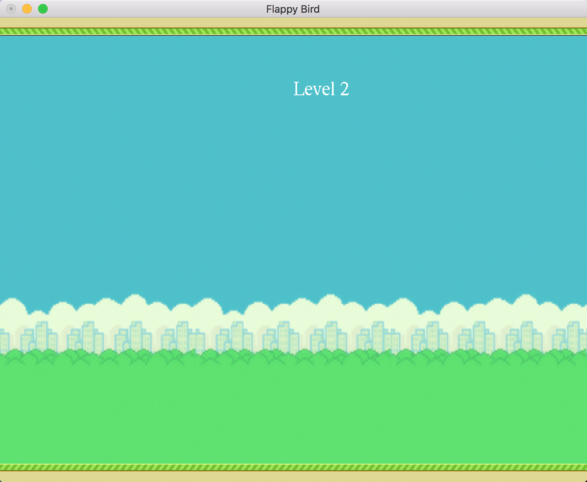
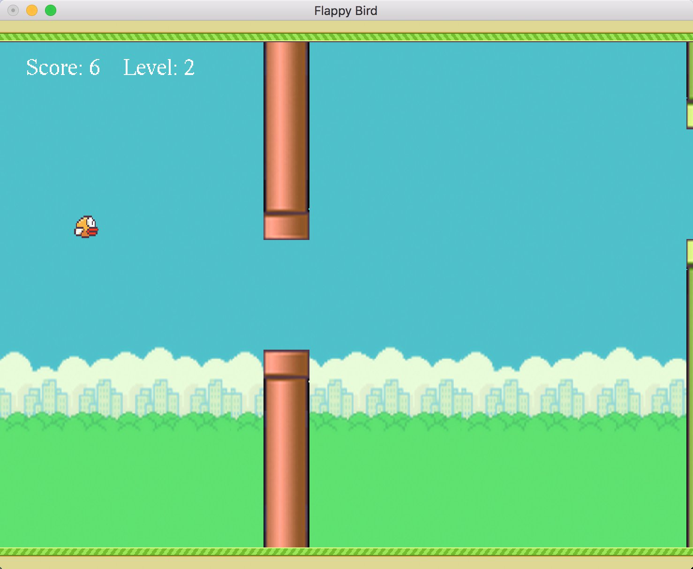
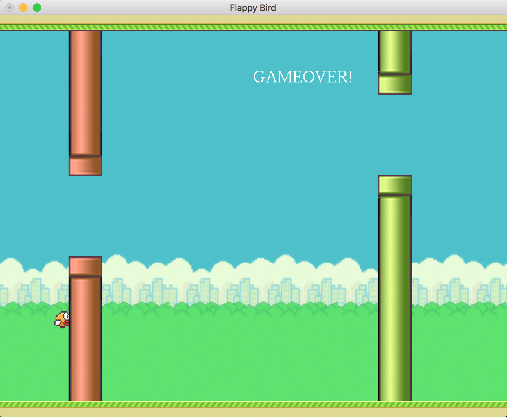
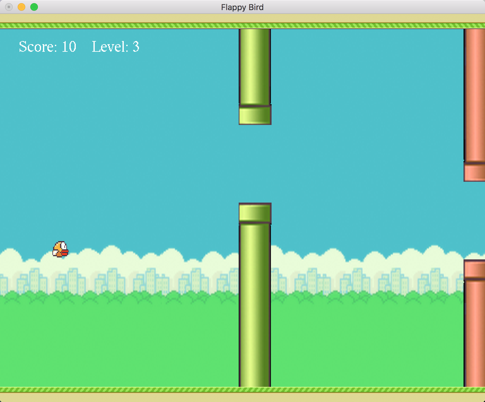
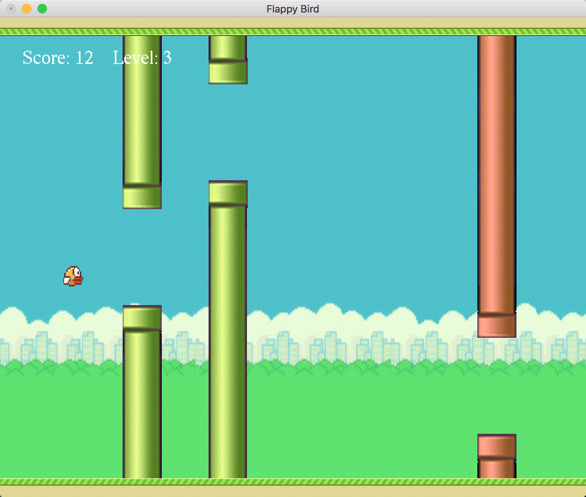
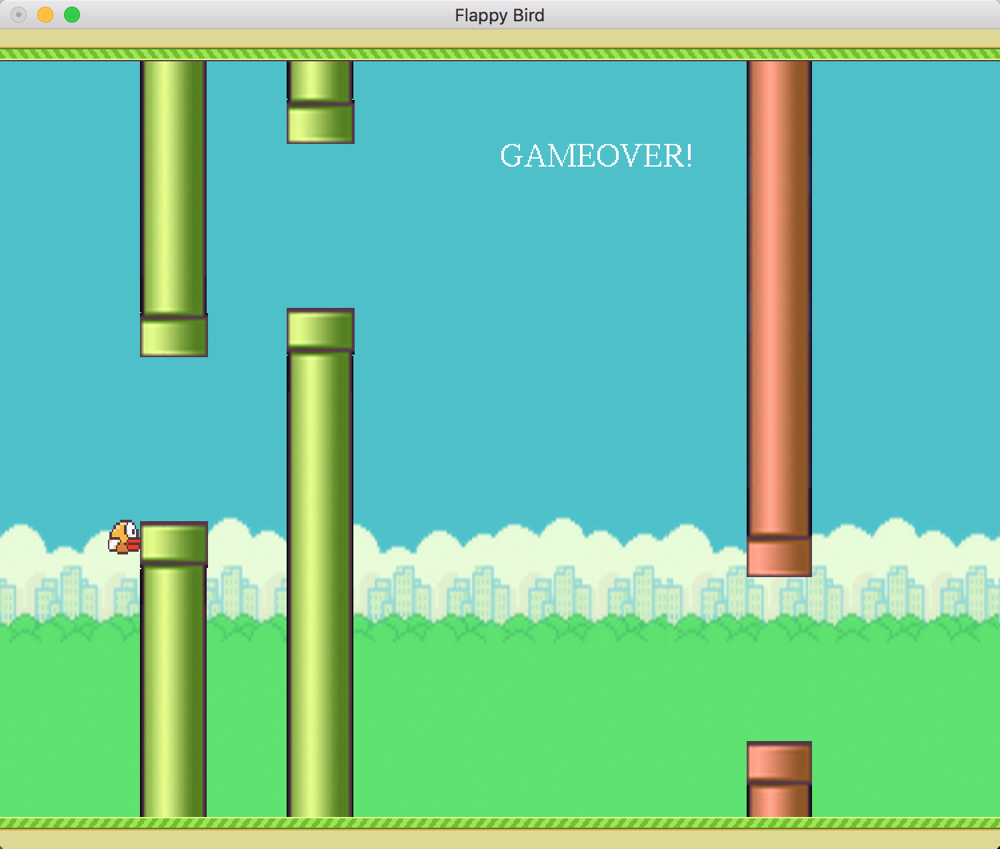

# FlappyBird

This is a simple game made in a pure functional programming language —— [Haskell](https://www.haskell.org).

To run the game, you must have Cabal installed in your OS. You can get it by installing the [Haskell Platform](https://www.haskell.org/platform/). 

# Usage
## OS X
```
git clone https://github.com/leftthomas/FlappyBird.git
cd FlappyBird
stack build
stack exec FlappyBird
```
The game has 3 levels. You are going to level up each at score 5, 10 and 15.

Controls: Press the up arrow key to control the bird and to pass the menu scenes.
## Ubuntu 16.04
### Step 1: Clone && build && exec
Follow OS X   
*If you are sucess, please ignore Step 2.*
### Step 2: Error process
[Error Process](https://github.com/BasicCoder/Haskell-Learning/blob/master/FixBuildFlappyBirdError.md)
# Reference Resources
- [Cabal User Guide](https://www.haskell.org/cabal/users-guide/) for building Haskell module.
- [Stack User Guide](https://github.com/commercialhaskell/stack/blob/master/doc/GUIDE.md) for building Haskell module.
- [Stackage](https://www.stackage.org) for searching Haskell packages and building with different release of GHC version.
- [Learn You a Haskell](http://learnyouahaskell.com) for learning Haskell language.
- [Real World Haskell](http://book.realworldhaskell.org/read/) for learning Haskell language.
- [FunGEn](http://fungen.joyful.com) for learning how to use functional game engine to write Haskell game.

# Game ScreenShot









